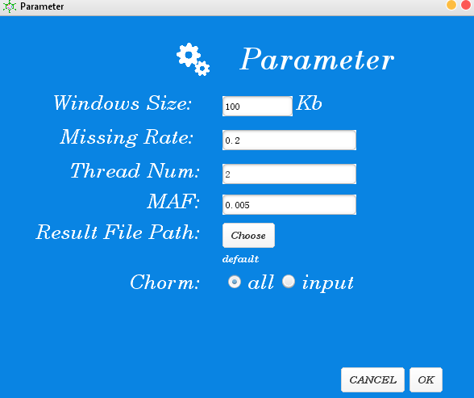

#  LDkit  [](https://github.com/tangyou79/LDkit/blob/master/README.md) [](https://github.com/tangyou79/LDkit/blob/master/README.md)

## a parallel computing toolkit for linkage disequilibrium analysis
</br>
<p align="center" >
<a>

</a>
</p>

</br>

### Contact:
> You Tang(tangyou@neau.edu.cn)

> Yao Zhou


</br>


### Contents
- [Pre-requirement](#Pre-requirement)
- [Installation](#Installation)
- [File Format](#File-Format)
    - [Genotype](#Genotype)
    - [Subgroup](#Subgroup)
- [Usage](#Usage)
    - [Run using Graphic User Interface (GUI)](#Run-using-Graphic-User-Interface)
    - [Steps for LD analysis](#Steps-for-LD-analysis)
        - [Step1: choose input files](#Step1-choose-input-files)
        - [Step2: set parameters for filtering variants](#Step2-set-parameters-for-filtering-variants)
        - [Step3: choose LD types](#Step3-choose-LD-types)
        - [Step4: set parameters for plotting](#Step4-set-parameters-for-plotting)
        - [Step5: checking your settings](#Step5-checking-your-settings)
        - [Step6: Run](#Step6-Run)
        - [Notes](#Notes)
    - [Run using command line](#Run-using-command-line)
        - [Step1: LD analysis](#Step1-LD-analysis)
        - [Step2: Plot](#Step2-Plot)
- [Examples](#Examples)

## Pre-requirement
**[back to top](#contents)**  
</br>


JDK1.8 or above. It can be downloaded at:

[http://www.oracle.com/technetwork/java/javase/downloads/jdk8-downloads-2133151.html](http://www.oracle.com/technetwork/java/javase/downloads/jdk8-downloads-2133151.html)


</br>

## Installation
**[back to top](#contents)**  
</br>
LDkit is free of installation.

GUI package is under the GUI folder, please double-click the LDkit\_GUI.jar to start.

Executable file **LDkit.jar** for command line users is on the executable folder

</br>

## File Format
**[back to top](#contents)**  
### Genotype:

Both PLINK ped and map format  and VCF format  are supported. VCF format could be compressed or uncompressed.

### Subgroup:

Subgroup should be formatted as:

        [subgroup1Name]:sample1,sample2,sample3…
        [subgroup2Name]:sample1,sample2,sample3…


</br>

## Usage:
**[back to top](#contents)**  
### Run using Graphic User Interface

GUI of LDkit is very easy to use. The main interface is like below:
<p align="center" >
<a>

</a>
</p>


</br>

### Steps for LD analysis:
**[back to top](#contents)**  

#### Step1 choose input files

<p align="center" >
<a>

</a>
</p>

1 Genotype file could be dragged into the window;

2 Multiple genotype files could be put in the same folder, and then choose the folder as input

3 Other files must choose from disk.

</br>

#### Step2 set parameters for filtering variants
**[back to top](#contents)**  
 
<p align="center" >
<a>

</a>
</p>

Window size: max distance between two variants (kb) for LD decay.

Missing rate: max ration of missing allele in the population.

Thread num: number of threads. Default is half of the available resources.

MAF: minor allele frequency

Output file: save output.

</br>

#### Step3 choose LD types
**[back to top](#contents)**  
<p align="center" >
<a>

</a>
</p>

Three types of LD analysis are supported by LDkit.  
LD site refer to the LD between a given site and a given region.

</br>

#### Step4 set parameters for plotting
**[back to top](#contents)**  
1. This step could be skipped if you want to plot with other software.

2. If you want to plot with previous results, you could just input the previous results and adjust the parameters here. You needn&#39;t to run step1-step3 again.

<p align="center" >
<a>

</a>
</p>

InFile: none or previous results generated by LDkit.

Merge: if your input is a folder with multiple files, you could merge them all together as one population.

Mergechr: If your input is a file with multiple chromosomes, you could plot each chromosome by choosing no.

Bin: the size of bin for calculating mean r² or D’. 

ResultName: file name for output.

</br>

#### Step5 choose LD measurements
**[back to top](#contents)**  
<p align="center" >
<a>

</a>
</p>

r² or D’ could be chose here. 

</br>

#### Step5: checking your settings
**[back to top](#contents)**  
Before you click start, you could check your parameters at right bottom.

<p align="center" >
<a>

</a>
</p>

</br>

#### Step6 Run
**[back to top](#contents)**  
After clicking the start button, the dynamic DNA strand shown above will run.

#### Notes:

1. If your input is a folder, you should make sure there is only file format. If more than one format in the folder, only the first appeared one will be used;

2. Do not support multiple files input for PLINK format;

3. PLINK format must be .ped and .map file suffix;

</br>

## Run using command line

### Step1 LD analysis:
**[back to top](#contents)**  

```bash
java -jar LDkit.jar --infile [input files] --output [output file] [parameters]
```


Parameters:

--infile: input file or folder

--out: output file

--ws: max distance between two variants (kb) for LD decay. Default is 100 Kb.

--subpop: input of subgroup files;

--chr: chromosome name if you just want to calculate one or some of them. Multiple chromosomes should be separated by comma. Default is all.

--maf: minor allele frequency filter. Default is 0.005;

--threads: number of threads, default is 1.

--type: measurements of LD. 1 for r-sqaure, 2 for D prime. Default is 1.

--Intermediate save the LD file for LD block or not. Default is no.

--block: chr:start-end. Region for LD block or LD site. For example: chr1:1000-20000;

--site: chr:start-end chr:site. Given site for LD site. For example: chr1:1000-2000 chr1:24556--h: help

</br>

### Step2 Plot
**[back to top](#contents)**  

```bash
java -jar LDkit.jar --plot --input [input files] --output [output file] [parameters]
```

Parameters:

--inp: input file for plot

--merge: plot all subgroups in one figure or not. Default is yes.

--mergechr: plot all chromosomes or not. Default is yes.

--bin: the size of bin for calculating mean r² or D&#39;.

</br>

## Examples
**[back to top](#contents)**  
1. LD decay for one population 
2. LD decay for partial chromosomes in a population 
3. LD decay for multiple subpopulations 
4. LD block analysis 
5. LD site analysis 
